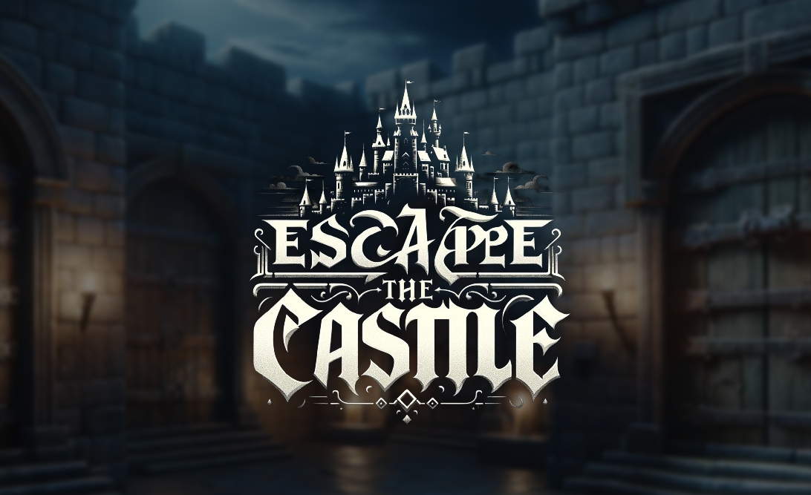

A simple puzzle game built from scratch in WebGL 2.

[Play it now ↗️](https://bartolomej.github.io/escape-the-castle/)

[Download the game ⤵️](https://github.com/bartolomej/escape-the-castle/releases)

## Usage

Install dependencies:
```shell
npm i
```

Run locally in dev mode:

```shell
npm run serve 
```

Build for production:

```shell
npm run build
```

Run the compiled prod assets using a HTTP file server (e.g. https://github.com/vercel/serve):

```shell
serve ./dist
```

## Credits

Part of the graphics engine source code is based on: [UL-FRI-LGM/webgl2-examples](https://github.com/UL-FRI-LGM/webgl2-examples).
